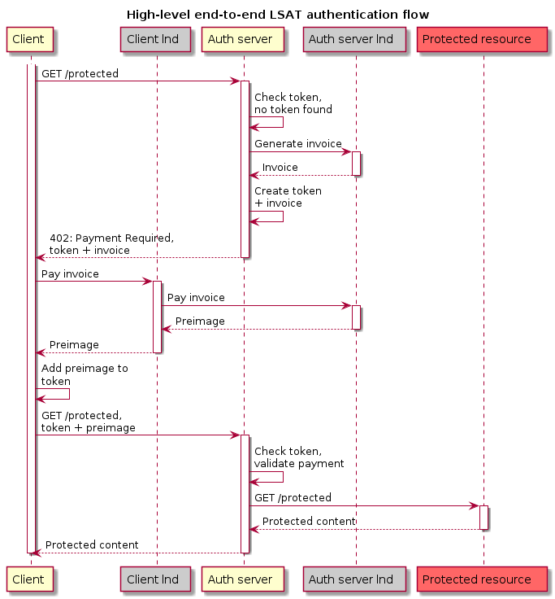

# Authentication Flow

This chapter explains the high-level authentication flow from the perspective of a user and their client software.

The requirements from the user's point of view are simple: They want to be able to use a service as frictionless as possible. They are perhaps used to the concept of needing to obtain an API access key first in order to use a service, but do not necessarily want to register an account with their personal information to do so.

A service using the L402 protocol supports exactly that requirement: The use of an API key without the need for creating an account first. And because no information needs to be input, the process of obtaining the API key can happen transparently to the user, in the background. 

Whenever an L402-compatible client software connects to a server that uses the protocol, it receives a prompt to pay an invoice over a very small amount \(a few satoshis\). Once the client software pays that invoice \(which can happen automatically if the amount does not exceed a user-defined threshold\), a valid API key or authentication token can be constructed. That credential is stored by the client's software and will be used for all future requests.

## Detailed authentication flow

The following steps describe the diagram further below. It is the flow of calls that take place for a client software that wants to access a protected resource that is secured by an authentication server.

As an example, we will look at the `loopd` client that wants to do a loop out swap with the Lightning Lab's loop server.

**First time looping out**:

1. A loop user wishes to perform a swap with the loop server. They type the

   command `loop out <amount>` and hit return.

2. The `loopd` client program contacts the loop server to initiate the swap.

3. The call from the client must always go through the authentication server

   reverse proxy, which in this example is `aperture`. The authentication proxy

   notices that the client didn't send an L402 and therefore cannot be granted

   access to the loop server.

4. `aperture` instructs its own `lnd` instance to create an invoice over a small

   amount that is required to acquire a fresh credential.

5. In addition to the invoice, `aperture` also creates a fresh access credential that is

   tied to the invoice. The credential is cryptographically constructed in a way that

   it is only valid once the invoice has been paid.

6. The credential and the invoice are sent back to the client in the previously

   unused HTTP header `402 Payment Required`.

7. The `loopd` understands this returned error code, extracts the invoice from

   it and automatically instructs its connected `lnd` instance to pay the

   invoice.

8. Paying the invoice results in the `loopd` client now possessing the

   cryptographic proof of payment \(the pre-image\). This proof is stored in the

   client's local storage, together with the access credential.

9. The combination of the access credential and the pre-image yields a fully valid

   L402 that can be cryptographically verified.

10. The client now repeats the original request to the loop server, now

    attaching the L402 to the request.

11. The authentication server intercepts the request, extracts the L402 and

    validates it. Because the L402 is valid, the request is forwarded to the

    actual loop server that then initiates the swap.

12. The answer of the swap server is returned to the client and the swap is

    now initiated.

13. The whole process is fully transparent to the user. The only thing they

    might notice is a short delay of a few seconds on the first ever loop. Each

    successive loop will use the same credential and will not be delayed at all.

**All further loops**:

1. For every new request to the server, the client now automatically attaches

   the credential that is stored locally.

2. As long as the credential has not expired, the steps 9-13 above will be followed.

   If/when the credential expires, the server will start over at step 4 and instruct

   the client to obtain a fresh credential.

