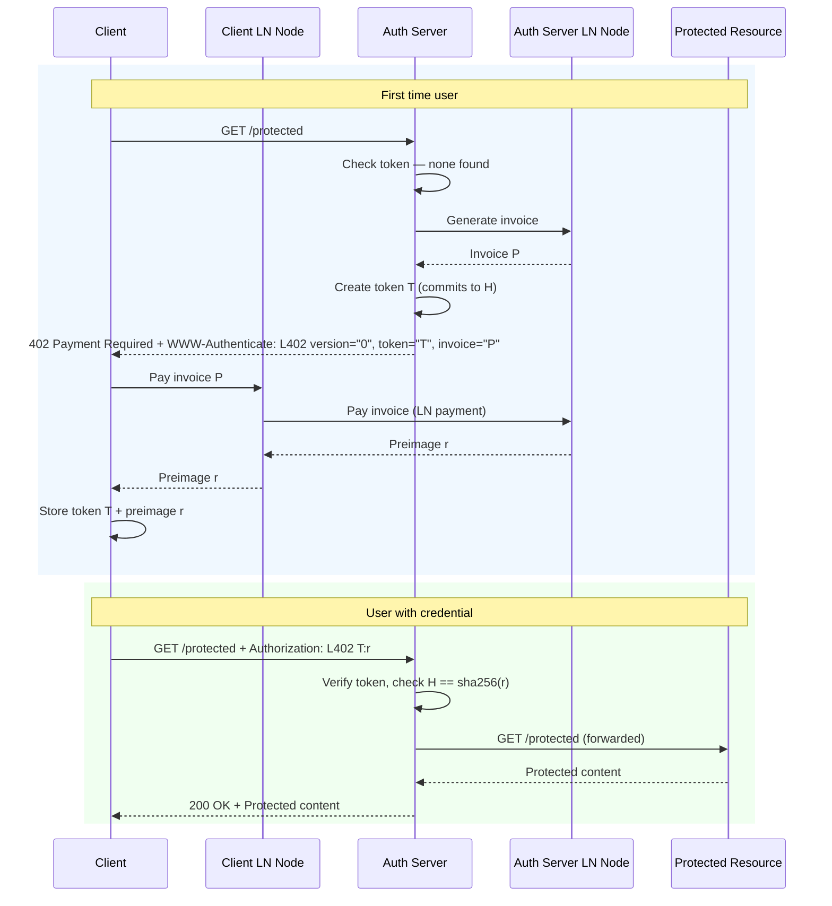

# Authentication Flow

This chapter explains the high-level authentication flow from the perspective of a user and their client software.

The requirements from the user's point of view are simple: They want to be able to use a service as frictionless as possible. They are perhaps used to the concept of needing to obtain an API access key first in order to use a service, but do not necessarily want to register an account with their personal information to do so.

A service using the L402 protocol supports exactly that requirement: The use of an API key without the need for creating an account first. And because no information needs to be input, the process of obtaining the API key can happen transparently to the user, in the background.

Whenever an L402-compatible client software connects to a server that uses the protocol, it receives a prompt to pay an invoice over a very small amount \(a few satoshis\). Once the client software pays that invoice \(which can happen automatically if the amount does not exceed a user-defined threshold\), a valid API key or authentication token can be constructed. That credential is stored by the client's software and will be used for all future requests.

## Protocol Flow Diagram


```mermaid
sequenceDiagram
    participant C as Client
    participant CL as Client LN Node
    participant A as Auth Server
    participant AL as Auth Server LN Node
    participant R as Protected Resource

    rect rgb(240, 248, 255)
    Note over C,R: First time user
    C->>A: GET /protected
    A->>A: Check token — none found
    A->>AL: Generate invoice
    AL-->>A: Invoice P
    A->>A: Create token T (commits to H)
    A-->>C: 402 Payment Required + WWW-Authenticate: L402 version="0", token="T", invoice="P"
    C->>CL: Pay invoice P
    CL->>AL: Pay invoice (LN payment)
    AL-->>CL: Preimage r
    CL-->>C: Preimage r
    C->>C: Store token T + preimage r
    end

    rect rgb(240, 255, 240)
    Note over C,R: User with credential
    C->>A: GET /protected + Authorization: L402 T:r
    A->>A: Verify token, check H == sha256(r)
    A->>R: GET /protected (forwarded)
    R-->>A: Protected content
    A-->>C: 200 OK + Protected content
    end
```

## Detailed Authentication Flow

The following steps describe the diagram above. It is the flow of calls that take place for a client software that wants to access a protected resource that is secured by an authentication server.

**First time accessing a protected resource**:

1. A user wishes to access a paid service or resource. Their client software issues an HTTP request to the server.

2. The call from the client must always go through the authentication server reverse proxy. The authentication proxy notices that the client didn't send an L402 and therefore cannot be granted access to the backend service.

3. The proxy instructs its own `lnd` instance to create an invoice over a small amount that is required to acquire a fresh credential.

4. In addition to the invoice, the proxy also creates a fresh authentication token that is tied to the invoice. The token is cryptographically constructed in a way that it is only valid once the invoice has been paid.

5. The token and the invoice are sent back to the client via the `WWW-Authenticate` header alongside the HTTP `402 Payment Required` status code:
   ```
   WWW-Authenticate: L402 version="0", token="<base64>", invoice="<bolt11>"
   ```

6. The client understands this returned error code, extracts the invoice from it and automatically instructs its connected Lightning node to pay the invoice.

7. Paying the invoice results in the client now possessing the cryptographic proof of payment \(the pre-image\). This proof is stored in the client's local storage, together with the authentication token.

8. The combination of the token and the pre-image yields a fully valid L402 credential that can be cryptographically verified.

9. The client now repeats the original request to the server, now attaching the L402 credential to the request via the `Authorization` header:
   ```
   Authorization: L402 <base64(token)>:<hex(preimage)>
   ```

10. The authentication server intercepts the request, extracts the L402 and validates it. Because the L402 is valid, the request is forwarded to the actual backend service.

11. The answer of the backend service is returned to the client.

12. The whole process is fully transparent to the user. The only thing they might notice is a short delay of a few seconds on the first ever request. Each successive request will use the same credential and will not be delayed at all.

**All further requests**:

1. For every new request to the server, the client now automatically attaches the credential that is stored locally.

2. As long as the credential has not expired, the steps 8-12 above will be followed. If/when the credential expires, the server will start over at step 3 and instruct the client to obtain a fresh credential.
