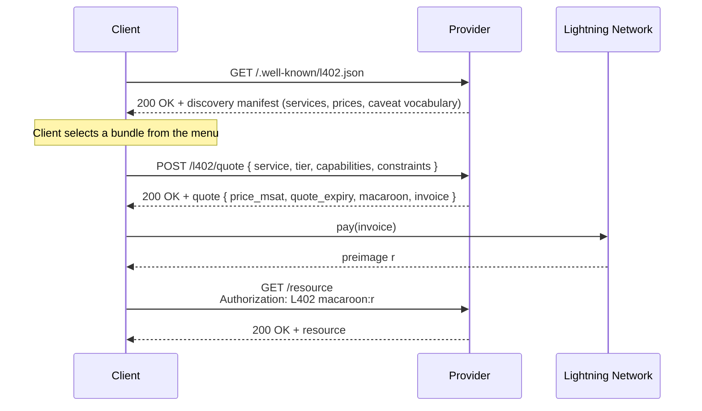

# L402 Discovery Specification

## 1. Introduction

The base [L402 protocol](protocol-specification.md) is reactive. A client learns
what a service offers, and what it costs, only by requesting a protected
resource and receiving an `HTTP 402` challenge in return. The challenge carries
exactly one invoice for exactly one resource. There is no way to learn a
service's catalog, its prices, its tier structure, or the caveat vocabulary it
enforces without first triggering a payment challenge for each individual
resource.

This document specifies an optional **discovery** layer for L402. Discovery
lets a client learn, ahead of any challenge, what a provider offers and how it
prices those offers. It defines two complementary mechanisms:

1. A static **discovery manifest**, served at a well-known location, that
   describes the provider's services, capabilities, tiers, caveat vocabulary,
   and prices. The manifest is free to fetch, cacheable, and indexable.

2. An optional **quote endpoint** that accepts a client's desired bundle and
   returns a price together with a ready-to-pay L402 challenge. The quote
   endpoint is where dynamic pricing and in-protocol negotiation live.

The central design property is that **discovery introduces no new payment or
verification machinery**. A quote response is an ordinary L402 challenge (a
macaroon committing to a payment hash, plus a Lightning invoice) issued
proactively for a bundle the client chose, rather than for a fixed resource the
client happened to request. Once a client holds a challenge, the remainder of
the flow (pay the invoice, present `Authorization: L402 <macaroon>:<preimage>`)
is identical to the base protocol. Discovery only changes how the challenge is
*selected*, never how it is *honored*.

The manifest itself comes in two interchangeable profiles that share one
vocabulary: a compact bespoke JSON document (Section 5), and a fully
self-describing [OpenAPI](https://www.openapis.org/) document that describes
every operation's request and response shape with the L402 pricing carried
inline (Section 8). The OpenAPI profile lets a client learn how the entire API
works, top to bottom and including prices, from a single fetch.

Discovery is OPTIONAL. A provider MAY implement the manifest alone, the manifest
and the quote endpoint together, or neither. A provider that implements neither
remains fully L402-compliant.

## 2. Requirements Language

The key words "MUST", "MUST NOT", "REQUIRED", "SHALL", "SHALL NOT", "SHOULD",
"SHOULD NOT", "RECOMMENDED", "NOT RECOMMENDED", "MAY", and "OPTIONAL" in this
document are to be interpreted as described in [BCP 14](https://tools.ietf.org/html/rfc2119)
\([RFC 2119](https://tools.ietf.org/html/rfc2119),
[RFC 8174](https://tools.ietf.org/html/rfc8174)\) when, and only when, they
appear in all capitals, as shown here.

## 3. Terminology

**Discovery Manifest.** A JSON document describing a provider's services,
prices, tiers, and caveat vocabulary. Served at a well-known URI and free to
fetch.

**Provider.** The entity that issues L402 challenges and operates the discovery
manifest and quote endpoint. A provider corresponds to one L402 proxy (for
example, one [Aperture](https://github.com/lightninglabs/aperture) deployment).

**Bundle.** A concrete selection a client wishes to purchase: a service, an
optional tier, a set of capabilities, and a set of constraint values. A bundle
maps directly onto the caveats of the macaroon that would be minted for it (see
[Macaroon Technical Specification](macaroon-spec.md), "Caveat Format").

**Quote.** A priced, time-bounded response to a proposed bundle. A quote
contains a price, an expiry, and an L402 challenge (macaroon plus invoice) that
honors the quoted price if paid before expiry.

**Quote Endpoint.** An HTTP endpoint that accepts a proposed bundle and returns
a quote. The URI of the quote endpoint is advertised in the manifest.

**Caveat Vocabulary.** The set of caveat conditions a provider understands and
enforces, published in the manifest so that clients can construct valid bundles
and valid attenuations.

## 4. Discovery Overview



A provider that publishes only fixed prices in its manifest MAY omit the quote
endpoint entirely. In that case the client reads the price from the manifest and
proceeds directly to the base L402 flow against the target resource, with no
quote round-trip.

## 5. The Discovery Manifest

### 5.1. Location

A provider that implements discovery MUST serve its manifest at the well-known
URI:

```
/.well-known/l402.json
```

per [RFC 8615](https://tools.ietf.org/html/rfc8615). The manifest MUST be served
with `Content-Type: application/json`.

The manifest MUST be fetchable without an L402 credential. A provider MUST NOT
return `402 Payment Required` for the manifest URI. The manifest is public
catalog data; gating it would defeat discovery.

A provider MAY additionally advertise a manifest at a non-default location by
returning a `Link` header on any response, including the `402` challenge itself:

```
Link: <https://example.com/.well-known/l402.json>; rel="l402-manifest"
```

Clients SHOULD honor a `Link` header with `rel="l402-manifest"` in preference to
probing the default path, since it allows per-host and per-path manifests.

The manifest carries no secrets, so to support browser-based agents a provider
SHOULD serve it with permissive CORS headers (for example
`Access-Control-Allow-Origin: *`). The same applies to the quote endpoint
(Section 6) and any OpenAPI document (Section 8).

### 5.2. Top-Level Structure

The manifest is a JSON object with the following members:

| Member | Type | Required | Description |
|--------|------|----------|-------------|
| `version` | string | REQUIRED | Manifest schema version. This document specifies `"1.0"`. |
| `provider` | object | REQUIRED | Provider identity (Section 5.3). |
| `currencies` | array of string | REQUIRED | Pricing units used in this manifest. MUST contain `"msat"`. MAY contain fiat reference codes (for example `"usd"`). |
| `macaroon_versions` | array of integer | RECOMMENDED | Macaroon identifier versions the provider mints. Currently `[0]`. |
| `payment_methods` | array of string | RECOMMENDED | Supported payment request types: `"bolt11"`, `"bolt12"`. Defaults to `["bolt11"]`. `"bolt12"` is EXPERIMENTAL (see note below). |
| `quote_endpoint` | string | OPTIONAL | URI (absolute or origin-relative) of the quote endpoint (Section 6). Absent if the provider offers only fixed prices. |
| `openapi` | string | OPTIONAL | URI of an OpenAPI document describing the full HTTP surface with inline L402 pricing extensions (Section 8). |
| `services` | array of object | REQUIRED | The service catalog (Section 5.4). |
| `caveats` | object | RECOMMENDED | The caveat vocabulary the provider enforces (Section 5.5). |
| `signature` | object | OPTIONAL | Provider signature over the manifest (Section 10.1). |

All prices in the manifest are expressed in **millisatoshis** (`msat`,
1/1000th of a satoshi), consistent with the base protocol's pricing unit. A fiat
entry in `currencies`, if present, is advisory only; the authoritative price is
always the `msat` amount on the invoice the client ultimately pays.

> **BOLT 12 is experimental in this version.** A macaroon's identifier MUST
> commit to the invoice's `payment_hash` (see [Macaroon Technical
> Specification](macaroon-spec.md), "Identifier Structure"), but a BOLT 12 offer
> does not expose a payment hash until an invoice is fetched over an onion
> message. The quote flow of Section 6 pre-mints the macaroon alongside the
> invoice, which a BOLT 11 invoice supports directly. The deferred-binding flow
> required for BOLT 12 (mint the macaroon only after the invoice is fetched, or
> bind the credential by a different commitment) is NOT specified here. A
> provider MAY advertise `"bolt12"`, but interoperability is not guaranteed until
> a future revision specifies the binding.

### 5.3. Provider Object

| Member | Type | Required | Description |
|--------|------|----------|-------------|
| `name` | string | REQUIRED | Human-readable provider name. |
| `uri` | string | OPTIONAL | Canonical base URI of the provider. |
| `node_pubkey` | string | OPTIONAL | Hex-encoded public key of the provider's Lightning node. When present, a client SHOULD verify that invoices in challenges and quotes are payable to this node. |

### 5.4. Service Catalog

`services` is an array of service objects. Each service object describes one
logical service, its tiers, its capabilities, and the resources it exposes.

| Member | Type | Required | Description |
|--------|------|----------|-------------|
| `name` | string | REQUIRED | Service name. MUST match the name used in the `services` caveat (Section 5.5). |
| `description` | string | OPTIONAL | Human-readable description. |
| `tiers` | array of object | OPTIONAL | Available tiers. Each tier has `tier` (uint8, base tier is `0`) and OPTIONAL `name` and `description`. If absent, the service has only the base tier `0`. |
| `capabilities` | array of string | OPTIONAL | Capability names offered by this service. If absent, the service exposes a single implicit capability. |
| `resources` | array of object | REQUIRED | The priced resources of this service (Section 5.4.1). |

#### 5.4.1. Resource Object

A resource is the unit a client pays for. It binds an HTTP-level entry point to
a price and a set of permissible constraints.

| Member | Type | Required | Description |
|--------|------|----------|-------------|
| `path` | string | OPTIONAL | Path template of the resource (for example `/v1/forecast`). |
| `method` | string | OPTIONAL | HTTP method. Defaults to `GET`. |
| `capability` | string | OPTIONAL | Capability this resource exercises. MUST be one of the service's `capabilities` if that list is present. |
| `pricing` | object | REQUIRED | Pricing for this resource (Section 5.4.2). |
| `constraints` | object | OPTIONAL | Constraints a client MAY set on a bundle for this resource (Section 5.4.3). |

A resource object describes *what* a resource costs and *which* service and
capability a credential for it must carry, but not necessarily *how to call it*:
the bespoke manifest's `path` is a template and does not describe path
parameters, query parameters, or request bodies. A client that needs call-level
detail SHOULD use the OpenAPI profile (Section 8), which describes the full
operation surface alongside the same pricing.

#### 5.4.2. Pricing Object

| Member | Type | Required | Description |
|--------|------|----------|-------------|
| `model` | string | REQUIRED | One of `"fixed"`, `"formula"`, or `"dynamic"`. |
| `price_msat` | integer | REQUIRED for `fixed` | The price in millisatoshis. |
| `base_msat` | integer | REQUIRED for `formula` | Base price before per-unit charges. |
| `components` | array of object | REQUIRED for `formula` | Per-unit charges (Section 5.4.2.1). |

The three pricing models are:

- **`fixed`.** The price is a constant `price_msat`, independent of constraints.
  A client can pay without contacting the quote endpoint: it constructs the
  bundle, requests the resource, and pays the resulting standard `402` challenge.
  A provider MAY also let the client obtain the same challenge through the quote
  endpoint for uniformity.

- **`formula`.** The price is computable by the client from the manifest alone:
  `price = base_msat + sum(component_i)`. This allows local price calculation for
  volume-scaled or duration-scaled resources without a round-trip, while keeping
  the provider authoritative (the invoice it ultimately issues is binding).

- **`dynamic`.** The price is not derivable from the manifest. The client MUST
  contact the `quote_endpoint` to obtain a price. This model supports
  load-based, time-based, or customer-based pricing.

A provider using `formula` or `dynamic` MUST advertise a `quote_endpoint` so
that a client always has an authoritative path to a payable challenge.

##### 5.4.2.1. Formula Component

| Member | Type | Required | Description |
|--------|------|----------|-------------|
| `constraint` | string | REQUIRED | The constraint key this component prices (Section 5.4.3). |
| `price_msat_per_unit` | integer | REQUIRED | Charge per unit of the constraint value. |
| `unit` | integer | OPTIONAL | Size of one unit. Defaults to `1`. The component charge is `price_msat_per_unit * ceil(value / unit)`. |

#### 5.4.3. Constraints Object

`constraints` maps a constraint key to its permissible bounds. The key MUST be a
caveat condition the provider understands (Section 5.5). The constraint value a
client selects becomes a caveat on the minted macaroon.

| Member | Type | Description |
|--------|------|-------------|
| `type` | string | Value type: `"integer"`, `"timestamp"`, `"string"`, or `"enum"`. |
| `max` | integer | OPTIONAL upper bound (for `integer`). |
| `min` | integer | OPTIONAL lower bound (for `integer`). |
| `max_duration_seconds` | integer | OPTIONAL maximum offset from now (for `timestamp`). |
| `values` | array | OPTIONAL permitted values (for `enum`). |

A client MUST NOT propose a constraint value outside the advertised bounds. A
provider MUST reject a quote request whose constraints violate the manifest, and
MUST NOT mint a macaroon whose caveats exceed what the manifest advertises.

### 5.5. Caveat Vocabulary

The `caveats` object publishes the caveat conditions the provider enforces, so
that a client can construct valid bundles and valid attenuations without trial
and error. Without it, the caveat vocabulary is opaque: a client cannot know
which conditions a provider's satisfiers understand (and which it silently skips
per the base protocol's unknown-caveat rule).

Each key is a caveat condition. Each value describes how the condition is
encoded and evaluated.

| Member | Type | Description |
|--------|------|-------------|
| `type` | string | Value type, as in Section 5.4.3, plus `"service_list"` for the `services` condition. |
| `description` | string | OPTIONAL human-readable meaning. |
| `attenuation` | string | OPTIONAL. How successive caveats of this condition must relate: `"subset"` (list narrows), `"decreasing"` (numeric value lowers), `"earlier"` (timestamp advances toward now). Mirrors the satisfier's `SatisfyPrevious` rule. |

**Example:**

```json
{
  "services":               { "type": "service_list", "attenuation": "subset" },
  "weather_capabilities":   { "type": "string", "attenuation": "subset" },
  "forecast_monthly_requests": { "type": "integer", "attenuation": "decreasing" },
  "valid_until":            { "type": "timestamp", "attenuation": "earlier" }
}
```

### 5.6. Complete Manifest Example

```json
{
  "version": "1.0",
  "provider": {
    "name": "Acme Weather",
    "uri": "https://api.weather.example",
    "node_pubkey": "021c97a90a411ff2b10dc2a8e32de2f29d2fa49d41bfbb52bd416e460db0747d0d"
  },
  "currencies": ["msat", "usd"],
  "macaroon_versions": [0],
  "payment_methods": ["bolt11"],
  "quote_endpoint": "/l402/quote",
  "openapi": "/openapi.json",
  "services": [
    {
      "name": "weather",
      "description": "Forecast and historical weather data.",
      "tiers": [
        { "tier": 0, "name": "base" },
        { "tier": 1, "name": "pro", "description": "Higher request limits." }
      ],
      "capabilities": ["forecast", "historical"],
      "resources": [
        {
          "path": "/v1/forecast",
          "method": "GET",
          "capability": "forecast",
          "pricing": {
            "model": "formula",
            "base_msat": 1000,
            "components": [
              {
                "constraint": "forecast_monthly_requests",
                "price_msat_per_unit": 10,
                "unit": 1
              }
            ]
          },
          "constraints": {
            "forecast_monthly_requests": { "type": "integer", "max": 1000000 },
            "valid_until": { "type": "timestamp", "max_duration_seconds": 2592000 }
          }
        }
      ]
    }
  ],
  "caveats": {
    "services": { "type": "service_list", "attenuation": "subset" },
    "weather_capabilities": { "type": "string", "attenuation": "subset" },
    "forecast_monthly_requests": { "type": "integer", "attenuation": "decreasing" },
    "valid_until": { "type": "timestamp", "attenuation": "earlier" }
  }
}
```

### 5.7. Bundle-to-Caveat Mapping

A bundle is realized as a set of first-party caveats on the minted macaroon. This
mapping is the contract that lets discovery reuse the base protocol's
verification path unchanged: the caveats a provider mints, and the caveats a
target resource's authorizer evaluates, are derived from the bundle by the same
deterministic rules. A provider MUST mint exactly these caveats, and a client
can reconstruct them to verify a quote (Section 6.2).

Given a bundle with service `s`, tier `t` (default `0`), capability set `C`, and
constraint map `K`, the caveats are, in order:

1. **Services caveat:** `services=s:t`. Exactly one, encoding the service name and
   the requested tier.

2. **Capabilities caveat:** `s_capabilities=c1,c2,...` listing the members of `C`
   in the order they appear in the service's `capabilities` array. If `C` is the
   service's full capability set, this caveat MAY be omitted, which (per the base
   protocol) permits all capabilities.

3. **Constraint caveats:** for each `(key, value)` in `K`, one caveat
   `key=value`. The `key` is used verbatim as the caveat condition: a manifest
   constraint key *is* the provider's caveat condition (Section 5.5). The `value`
   is rendered in its canonical form: a decimal integer for `integer`, a decimal
   Unix timestamp for `timestamp`, and the literal string for `string` and
   `enum`.

The preimage is not part of the bundle; it is added by the client after payment
per the base protocol. These caveats are appended to the macaroon's HMAC chain as
ordinary first-party caveats ([Macaroon Technical Specification](macaroon-spec.md),
"Minting"). A provider MUST NOT add caveats that widen authority beyond the
bundle, and MUST NOT omit a constraint the client requested.

**Example.** The bundle
`{ service: weather, tier: 1, capabilities: [forecast], constraints: { forecast_monthly_requests: 100000, valid_until: 1735689600 } }`
maps to:

```text
services=weather:1
weather_capabilities=forecast
forecast_monthly_requests=100000
valid_until=1735689600
```

## 6. The Quote Endpoint

The quote endpoint turns a proposed bundle into a payable L402 challenge. It is
the locus of dynamic pricing and in-protocol negotiation. A provider that
advertises a `quote_endpoint` MUST implement this section.

### 6.1. Quote Request

A client requests a quote with an HTTP `POST` to the `quote_endpoint`, with a
JSON body describing the desired bundle:

| Member | Type | Required | Description |
|--------|------|----------|-------------|
| `service` | string | REQUIRED | Service name from the manifest. |
| `tier` | integer | OPTIONAL | Requested tier. Defaults to `0`. |
| `capabilities` | array of string | OPTIONAL | Requested capabilities. Defaults to all capabilities of the service. |
| `constraints` | object | OPTIONAL | Constraint key/value pairs, within the manifest's bounds. |
| `max_price_msat` | integer | OPTIONAL | The client's budget ceiling. The provider SHOULD NOT return a primary quote above this, and SHOULD prefer `alternatives` that fit it (Section 6.3). |
| `optimize` | string | OPTIONAL | Negotiation hint for how the provider should shape `alternatives`: `"price"` (cheapest), `"volume"` (most capacity per msat), or `"duration"` (longest validity per msat). |
| `token_id` | string | OPTIONAL | Hex-encoded `token_id` of an existing credential, for upgrade or returning-customer pricing (Section 6.4). |
| `payment_method` | string | OPTIONAL | Preferred payment method. Defaults to `"bolt11"`. `"bolt12"` is experimental (Section 5.2). |

**Example:**

```json
{
  "service": "weather",
  "tier": 1,
  "capabilities": ["forecast"],
  "constraints": {
    "forecast_monthly_requests": 100000,
    "valid_until": 1735689600
  }
}
```

The quote endpoint MUST be fetchable without an L402 credential. A provider
SHOULD rate-limit quote requests to bound the cost of invoice minting (Section
10.3).

### 6.2. Quote Response

The provider responds with `200 OK` and a JSON quote:

| Member | Type | Required | Description |
|--------|------|----------|-------------|
| `price_msat` | integer | REQUIRED | Price for the quoted bundle. |
| `quote_expiry` | integer | REQUIRED | Unix timestamp after which the quote (and its invoice) is no longer honored. |
| `macaroon` | string | REQUIRED | Base64-encoded macaroon, pre-minted with the caveats of the quoted bundle (Section 5.7) and committing to the payment hash of `invoice`. |
| `invoice` | string | REQUIRED | BOLT 11 payment request for `price_msat`. Its `expiry` SHOULD equal `quote_expiry` (Section 6.3). BOLT 12 is experimental (Section 5.2). |
| `alternatives` | array of object | OPTIONAL | Counter-offers (Section 6.3). |
| `price_fiat` | object | OPTIONAL | Advisory fiat reference, for example `{ "usd": "0.0005" }`. |

The `macaroon` and `invoice` together form a standard L402 challenge,
constructed exactly as in the base protocol's server flow
([Protocol Specification](protocol-specification.md), Section 6.1) and the
minting procedure ([Macaroon Technical Specification](macaroon-spec.md),
"Minting"). The only difference is that the caveats encode the client's
*requested* bundle rather than a fixed resource's defaults.

Before paying, a client SHOULD validate the returned challenge, since the
provider, not the client, minted it:

1. Decode the `macaroon` and confirm its identifier's `payment_hash` equals the
   payment hash of `invoice`. This binds the credential to the invoice the client
   is about to pay.
2. Confirm the macaroon's caveats are exactly the bundle-to-caveat mapping of the
   requested bundle (Section 5.7), and in particular are no more restrictive than
   requested. A macaroon weaker than the bundle, or bound to a different payment
   hash, means the client would pay for authority it did not request.
3. Apply the maximum-payment threshold to `price_msat` and to the invoice amount
   (Section 10.2).

If any check fails, the client MUST NOT pay. Otherwise it pays `invoice`, obtains
the preimage `r`, and presents `Authorization: L402 <macaroon>:<r>` to the target
resource. No further interaction with the quote endpoint is required, and the
target resource verifies the credential with the unmodified base-protocol
verification path.

For a `fixed` or `formula` resource the returned `price_msat` equals the manifest
computation, and the quote's value is simply that it also yields a ready-to-pay
challenge without the reactive `402` round-trip. For a `dynamic` resource the
quote is the only way to learn the price.

**Example** (pricing the `formula` resource of Section 5.6 for 100000 monthly
requests: `base_msat 1000 + 10 * 100000 = 1001000`):

```json
{
  "price_msat": 1001000,
  "quote_expiry": 1730000000,
  "macaroon": "AGIAJEemVQUTEyNCR0exk7ek90Cg==",
  "invoice": "lnbc10010n1p...",
  "alternatives": [
    {
      "tier": 0,
      "price_msat": 501000,
      "constraints": { "forecast_monthly_requests": 50000 }
    }
  ]
}
```

### 6.3. Negotiation and Alternatives

The quote response MAY include an `alternatives` array. Each alternative is a
counter-offer the provider is willing to honor: a different tier, a different
constraint set, or a different price. An alternative object has the shape of a
quote request (Section 6.1) plus a `price_msat`, and MAY itself carry a
`macaroon` and `invoice` so the client can accept it directly.

This makes negotiation a single round-trip in the common case: the client
proposes a bundle, and the provider responds with both a firm quote for that
bundle and a set of nearby offers. The client steers that response with the
optional `max_price_msat` and `optimize` fields of the quote request (Section
6.1): a provider SHOULD keep the primary quote within `max_price_msat` when it
can, and SHOULD shape `alternatives` toward the client's `optimize` preference
(cheaper, more volume, or longer validity). A client that wants a different point
on the price curve issues another quote request with adjusted constraints.
Multi-round counter-offer protocols are out of scope for this version and MAY be
layered on top by a provider.

A quote is **firm** until `quote_expiry`: the provider MUST honor `price_msat`
for any payment of `invoice` received before that time. Enforcement of the
expiry, however, lives at the Lightning layer, not in the credential: the target
resource verifies only macaroon integrity, the payment-hash/preimage relation,
and the caveats, none of which encode `quote_expiry` or the price. Once the
invoice is paid the credential is valid by the base verification path regardless
of when payment occurred. A provider MUST therefore set the BOLT 11 invoice's
own `expiry` no later than `quote_expiry`, so that an expired quote corresponds
to an unpayable invoice. A provider that additionally wants the *credential* to
expire (not just the offer) MUST encode that as a `valid_until`-style caveat in
the bundle, which the resource's satisfier then enforces.

### 6.4. Dynamic Pricing Inputs

A provider MAY price a quote using any inputs available to it, including:

- The requested bundle (tier, capabilities, constraint magnitudes).
- Current load or inventory.
- Time of day or other temporal factors.
- The optional `token_id`, which lets a provider offer upgrade pricing (charging
  only the difference from an existing credential) or returning-customer pricing
  without learning the client's identity. The `token_id` is the stable user
  identifier carried in the macaroon across rotations
  ([Macaroon Technical Specification](macaroon-spec.md), "Identifier Structure").

Pricing inputs are entirely a provider concern. This specification constrains
only the *shape* of the request and response, not the pricing policy.

### 6.5. Errors

When the provider cannot return a quote, it MUST respond with a non-`200` status
and a JSON body of the form:

```json
{ "error": { "code": "<machine_code>", "message": "<human readable>", "field": "<optional>" } }
```

The `code` is a stable machine-readable token; `message` is for human
diagnostics; `field` names the offending request member when applicable. Clients
MUST branch on `code`, not on `message`.

| Status | `code` | Meaning |
|--------|--------|---------|
| 400 | `malformed_request` | The body is not valid JSON or is missing a required member. |
| 400 | `unknown_service` | `service` does not exist in the manifest. |
| 400 | `unknown_capability` | A requested capability is not offered by the service. |
| 400 | `constraint_out_of_bounds` | A constraint value violates the manifest's bounds (Section 5.4.3). `field` names the constraint. |
| 400 | `invalid_constraint` | A constraint key is unknown, or its value has the wrong type. `field` names the constraint. |
| 402 | `quote_requires_payment` | The quote endpoint is itself L402-gated (Section 10.3); the body is the standard `402` challenge rather than the error envelope. |
| 409 | `unsatisfiable_budget` | No offer fits the requested `max_price_msat`. The provider SHOULD still return `alternatives` in an accompanying quote when it can. |
| 429 | `rate_limited` | The client exceeded the quote rate limit (Section 10.3). The provider SHOULD send `Retry-After`. |
| 503 | `unpriceable` | The bundle is valid but temporarily cannot be priced or fulfilled (load, inventory). |

A provider that does not implement the quote endpoint at all returns `404` for
its URI; this is distinct from the error envelope and signals the client to use
the manifest's static prices or the reactive flow.

## 7. Caching and Freshness

The manifest SHOULD be served with HTTP caching headers (`Cache-Control`,
`ETag`) so that clients and intermediaries can cache it. Catalog data changes
slowly; prices for `dynamic` resources are deliberately not in the manifest, so
caching the manifest does not risk serving stale prices for those resources.

A client MUST NOT treat a `fixed` or `formula` price from a cached manifest as
binding. The authoritative price is always the amount on the invoice the client
is asked to pay (in a `402` challenge or a quote). The manifest's prices are
advisory and let a client decide whether to proceed before requesting a
challenge.

Quotes carry their own freshness via `quote_expiry` and MUST NOT be cached
beyond it.

## 8. Self-Describing Discovery via OpenAPI

The bespoke manifest of Section 5 is a compact catalog: it describes *what* a
provider sells and *what it costs*, but not the full request and response shape
of every operation. A provider that wants discovery to be **fully
self-describing**, so that a single fetch tells a client how the entire API
works top to bottom *including* L402 pricing, SHOULD additionally publish an
[OpenAPI 3.1](https://www.openapis.org/) document that carries the L402 pricing
information inline through the `x-l402-*` extension vocabulary defined here.

This yields two interoperable discovery profiles that share one vocabulary:

- **Lightweight profile.** The bespoke `l402.json` manifest (Section 5). Small,
  cacheable, and sufficient for a client that only needs the catalog and prices.

- **Self-describing profile.** An OpenAPI document describing every operation's
  parameters, request bodies, and responses, annotated with `x-l402-*`
  extensions so the same pricing, tier, capability, and caveat information is
  present per operation. One document, one fetch, the whole API.

A provider MAY publish either profile or both. When it publishes both, the
manifest SHOULD link to the OpenAPI document via the top-level `openapi` member,
and the two MUST be consistent (Section 8.4). Both profiles reuse the caveat
vocabulary of Section 5.5 unchanged.

### 8.1. Locating the OpenAPI Document

A provider SHOULD reference its OpenAPI document from the manifest's `openapi`
member. A provider MAY also advertise it independently with a `Link` header:

```
Link: <https://api.example.com/openapi.json>; rel="service-desc"
```

per the OpenAPI-registered `service-desc` relation. A client that holds only the
OpenAPI document, with no separate manifest, can still perform full discovery: the
root-level extensions (Section 8.2) carry everything the manifest's top level
would.

### 8.2. The `x-l402-*` Extension Vocabulary

The L402-specific concepts have no native slot in OpenAPI, since OpenAPI
describes operations rather than priced, attenuable bundles. They are carried in
vendor extensions, which OpenAPI permits on any object via members prefixed
`x-`. The mapping is normative:

| L402 concept | Extension key | Location |
|--------------|---------------|----------|
| Manifest schema version | `x-l402-version` | root (`info`) |
| Provider object (Section 5.3) | `x-l402-provider` | root (`info`) |
| Caveat vocabulary (Section 5.5) | `x-l402-caveats` | root |
| Quote endpoint URI | `x-l402-quote-endpoint` | root (the endpoint itself is also a `paths` entry) |
| Service name (Section 5.4) | `x-l402-service` | operation |
| Tiers (Section 5.4) | `x-l402-tiers` | operation or service-level extension |
| Capability (Section 5.4) | `x-l402-capability` | operation |
| Pricing object (Section 5.4.2) | `x-l402-pricing` | operation |
| Constraints (Section 5.4.3) | `x-l402-constraints` | operation |

The value of each extension is the **same JSON shape** as the corresponding
manifest member. `x-l402-pricing` is a pricing object with a `model` of `fixed`,
`formula`, or `dynamic`; `x-l402-constraints` is a constraints object; and so on.
An implementation that already validates manifest members validates the
extension payloads with the identical logic.

The `402` challenge a paid operation issues SHOULD be documented as a native
OpenAPI `402` response with a `WWW-Authenticate` header, so the payment
challenge is visible to generic OpenAPI tooling even though the pricing lives in
the extension.

### 8.3. Worked Example

The Acme Weather service of Section 5.6, expressed as a self-describing OpenAPI
document:

```yaml
openapi: 3.1.0
info:
  title: Acme Weather
  version: "1.0"
  x-l402-version: "1.0"
  x-l402-provider:
    node_pubkey: "021c97a90a411ff2b10dc2a8e32de2f29d2fa49d41bfbb52bd416e460db0747d0d"
    currencies: ["msat", "usd"]
servers:
  - url: https://api.weather.example
x-l402-quote-endpoint: /l402/quote
x-l402-caveats:
  services: { type: service_list, attenuation: subset }
  weather_capabilities: { type: string, attenuation: subset }
  forecast_monthly_requests: { type: integer, attenuation: decreasing }
  valid_until: { type: timestamp, attenuation: earlier }
components:
  securitySchemes:
    L402:                   # see Section 8.5 on the scheme encoding choice
      type: apiKey
      in: header
      name: Authorization
      x-l402-scheme: L402
paths:
  /v1/forecast:
    get:
      operationId: getForecast
      security: [{ L402: [] }]
      x-l402-service: weather
      x-l402-capability: forecast
      x-l402-tiers:
        - { tier: 0, name: base }
        - { tier: 1, name: pro }
      x-l402-pricing:
        model: formula
        base_msat: 1000
        components:
          - { constraint: forecast_monthly_requests, price_msat_per_unit: 10, unit: 1 }
      x-l402-constraints:
        forecast_monthly_requests: { type: integer, max: 1000000 }
        valid_until: { type: timestamp, max_duration_seconds: 2592000 }
      parameters:
        - { name: lat, in: query, required: true, schema: { type: number } }
        - { name: lon, in: query, required: true, schema: { type: number } }
      responses:
        "402":
          description: Payment Required (L402 challenge)
          headers:
            WWW-Authenticate:
              schema: { type: string }
              description: 'L402 macaroon="<base64>", invoice="<bolt11>"'
        "200":
          description: Forecast
          content:
            application/json:
              schema: { type: object }
  /l402/quote:
    post:
      operationId: l402Quote
      requestBody:
        content:
          application/json:
            schema:
              type: object
              required: [service]
              properties:
                service: { type: string }
                tier: { type: integer }
                capabilities: { type: array, items: { type: string } }
                constraints: { type: object, additionalProperties: true }
                token_id: { type: string }
      responses:
        "200":
          description: Quote
          content:
            application/json:
              schema:
                type: object
                required: [price_msat, quote_expiry, macaroon, invoice]
                properties:
                  price_msat: { type: integer }
                  quote_expiry: { type: integer }
                  macaroon: { type: string }
                  invoice: { type: string }
                  alternatives: { type: array, items: { type: object } }
```

### 8.4. Consistency Between Profiles

When a provider serves both a manifest and an OpenAPI document, they MUST
describe the same services, prices, constraints, and caveat vocabulary. If they
disagree, a client SHOULD prefer the document it fetched and, in all cases, MUST
treat the `msat` amount on the invoice it is actually asked to pay as
authoritative (Section 10.2). Neither document is a price guarantee; both are
advisory until a challenge or quote produces a concrete invoice.

### 8.5. The L402 Security Scheme

The OpenAPI `securityScheme` block is descriptive only. It tells a consumer how
to attach the credential; it does not change verification, which remains the
macaroon HMAC check and the `H == sha256(preimage)` check of the base protocol.
Its job is graceful degradation for tooling, so the encoding is chosen for
compatibility.

A provider SHOULD declare the credential as an `apiKey` scheme carried in the
`Authorization` header:

```yaml
components:
  securitySchemes:
    L402:
      type: apiKey
      in: header
      name: Authorization
      x-l402-scheme: L402     # recovers the auth-scheme name for L402-aware tooling
```

This is understood by generic OpenAPI tooling (renderers and code generators
handle `apiKey` uniformly), and the `x-l402-scheme` extension recovers the true
HTTP authentication scheme name for L402-aware consumers.

A provider MAY instead declare `type: http, scheme: L402`, which is the more
faithful encoding of an `Authorization: L402 ...` credential. The token `L402` is
not registered in the IANA HTTP Authentication Scheme Registry, so generic
tooling may not recognize it; this encoding suits audiences that are already
L402-aware. A provider MUST NOT use `scheme: bearer`, since that implies an
`Authorization: Bearer ...` header, which is not the L402 wire format.

Either way, the value transmitted is the base protocol's
`Authorization: L402 <base64(macaroon)>:<hex(preimage)>` credential. Because the
`apiKey` encoding presents the credential as an opaque header value, a client or
generator MUST NOT treat it as a static secret: the credential is obtained
through the L402 payment flow (or a quote), is attenuable, and is revocable, and
MUST NOT be hardcoded. The authoritative description of the challenge for any
paid operation is its native `402` response and `WWW-Authenticate` header
(Section 8.2).

## 9. Versioning and Extensibility

The top-level `version` member (or `x-l402-version` in the OpenAPI profile)
identifies the manifest schema version. This document specifies `"1.0"`. A
client encountering an unrecognized major version SHOULD attempt to parse the
members it understands and ignore the rest, and MAY fall back to the base
reactive L402 flow.

Implementations MUST ignore unknown members in any object in the manifest, the
quote messages, and the `x-l402-*` extensions, rather than rejecting the
document. This mirrors the base protocol's unknown-caveat rule and lets providers
add fields without breaking existing clients.

## 10. Security Considerations

### 10.1. Manifest and Quote Authenticity

The manifest and quotes are served over TLS, which authenticates them
point-to-point ([Protocol Specification](protocol-specification.md), Section
9.1). TLS is sufficient when the client fetches directly from the provider.

When a manifest or quote is relayed or cached by an untrusted intermediary (for
example, an aggregator or marketplace that indexes many providers), TLS does not
help, since the relay is not the origin. For those deployments a provider MAY
include a `signature` object signing the canonical serialization of the manifest
(or quote) with its Lightning `node_pubkey`. A client that trusts the
`node_pubkey` can then verify provider authorship independent of transport. The
canonicalization rules and signature encoding are left to a future revision and
MUST be treated as OPTIONAL until specified.

Independent of any signature, a client SHOULD verify that the `invoice` in a
challenge or quote is payable to the `node_pubkey` advertised in the manifest,
when present.

### 10.2. Price Integrity

A client MUST NOT rely on a manifest price as a guarantee. The only binding
price is the `msat` amount on the invoice the client is asked to pay. A client
MUST apply its configured maximum-payment threshold
([Protocol Specification](protocol-specification.md), Section 9.5) to that
invoice amount before paying, regardless of what the manifest advertised. This
prevents a tampered or stale manifest from inducing an over-payment, since the
final check is always against the actual invoice.

### 10.3. Quote Endpoint Denial of Service

Each quote request that returns a `macaroon` and `invoice` requires the provider
to mint a macaroon and create a Lightning invoice, both of which consume
resources. A provider SHOULD rate-limit quote requests, and MAY require a cheap
proof of work or a small L402 payment for the quote endpoint itself if abuse is a
concern. A provider MAY also return a price-only quote (omitting `macaroon` and
`invoice`) for exploratory requests, minting the challenge only when the client
signals intent to pay.

### 10.4. Information Disclosure

The manifest publicly discloses a provider's catalog and pricing structure.
Providers that consider parts of their catalog sensitive SHOULD omit them from
the manifest and continue to serve those resources through the base reactive
flow. Discovery is additive: anything not in the manifest behaves exactly as it
does today.

## 11. Backwards Compatibility

Discovery is fully backwards compatible with the base L402 protocol. A client
that does not implement discovery ignores the manifest and the `Link` header and
uses the reactive `402` flow unchanged. A server that does not implement
discovery returns no manifest; a discovery-aware client that receives `404` for
`/.well-known/l402.json` and finds no `l402-manifest` `Link` header MUST fall
back to the reactive flow.

Because a quote response is an ordinary L402 challenge, credentials obtained
through discovery are indistinguishable, at verification time, from credentials
obtained through the reactive flow. No change to verifiers or to the base
protocol's wire formats is required.

## 12. References

- [L402 Protocol Specification](protocol-specification.md)
- [Macaroon Technical Specification](macaroon-spec.md)
- [RFC 2119: Key words for use in RFCs](https://tools.ietf.org/html/rfc2119)
- [RFC 8174: RFC 2119 Clarification](https://tools.ietf.org/html/rfc8174)
- [RFC 8615: Well-Known Uniform Resource Identifiers](https://tools.ietf.org/html/rfc8615)
- [BOLT 11: Invoice Protocol](https://github.com/lightning/bolts/blob/master/11-payment-encoding.md)
- [BOLT 12: Offers](https://github.com/lightning/bolts/blob/master/12-offer-encoding.md)
- [OpenAPI Specification](https://www.openapis.org/)
