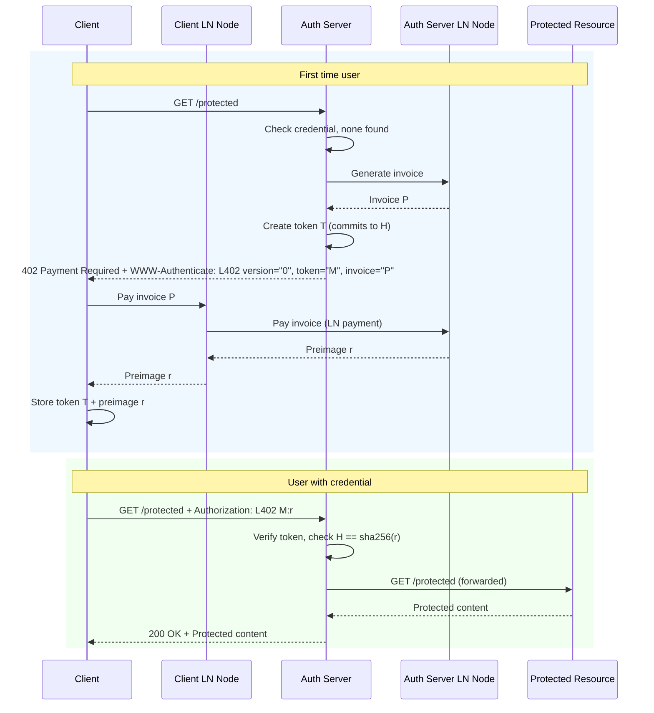

# Authentication Flow

This chapter explains the high-level authentication flow from the perspective
of a user and their client software.

The requirements from the user's point of view are simple: they want to use a
service as frictionlessly as possible. They may be used to the concept of
obtaining an API access key, but don't necessarily want to register an account
with their personal information.

A service using the L402 protocol supports exactly that requirement: the use of
an API key without creating an account first. And because no personal
information needs to be entered, the process of obtaining the key can happen
transparently in the background.

Whenever an L402-compatible client connects to a server that uses the protocol,
it receives a prompt to pay an invoice over a small amount (a few satoshis).
Once the client pays that invoice (which can happen automatically if the amount
doesn't exceed a user-defined threshold), a valid credential can be
constructed. That credential is stored locally and reused for all future
requests.

## Protocol Flow Diagram



## Detailed Authentication Flow

The following steps describe the diagram above. It is the flow of calls that
take place for a client that wants to access a protected resource secured by an
authentication server.

**First time accessing a protected resource:**

1. A user wishes to access a paid service or resource. Their client software
   issues an HTTP request to the server.

2. The call passes through the authentication server reverse proxy. The proxy
   notices the client didn't send an L402 credential and cannot be granted
   access to the backend service.

3. The proxy instructs its backing Lightning node to create an invoice over the
   small amount required to acquire a fresh credential.

4. In addition to the invoice, the proxy creates a fresh authentication token
   tied to the invoice. The token is cryptographically constructed so that it
   is only valid once the invoice has been paid (the token commits to the
   invoice's payment hash).

5. The token and invoice are sent back to the client via the
   `WWW-Authenticate` header alongside the HTTP 402 status code:
   ```
   WWW-Authenticate: L402 version="0", token="<base64>", invoice="<bolt11>"
   ```

6. The client extracts the invoice and automatically instructs its connected
   Lightning node to pay it.

7. Paying the invoice reveals the cryptographic proof of payment (the
   preimage). The client stores the preimage alongside the token.

8. The combination of the token and preimage yields a fully valid L402
   credential that can be cryptographically verified.

9. The client repeats the original request, attaching the L402 credential via
   the `Authorization` header:
   ```
   Authorization: L402 <base64(token)>:<hex(preimage)>
   ```

10. The authentication server intercepts the request, extracts the L402, and
    validates it. Because the credential is valid, the request is forwarded to
    the actual backend service.

11. The backend's response is returned to the client.

12. The whole process is fully transparent to the user. The only thing they
    might notice is a short delay of a few seconds on the first request. Each
    successive request reuses the same credential with no delay.

**All further requests:**

1. For every new request, the client automatically attaches the credential
   stored locally.

2. As long as the credential has not been revoked, steps 9-12 above are
   followed. If/when the credential expires or is revoked, the server issues a
   fresh 402 challenge and the client obtains a new credential.
