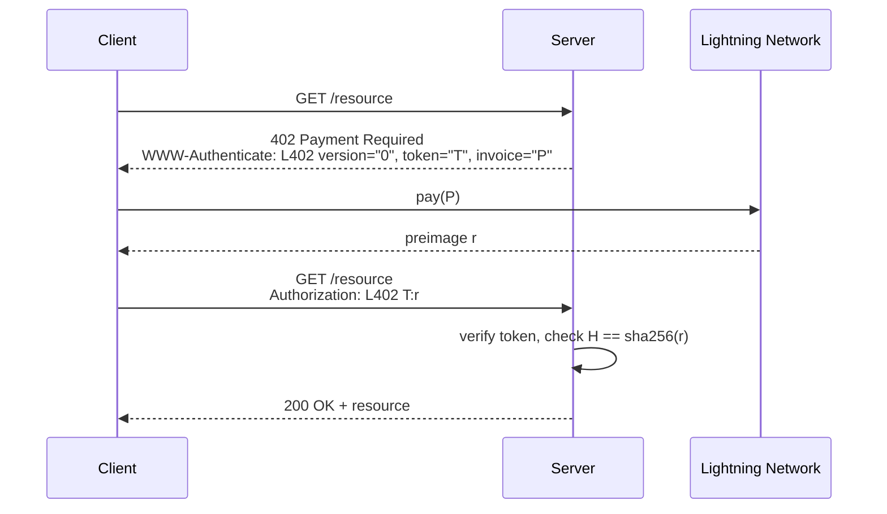

# L402 Protocol Specification

## 1. Introduction

This document specifies the L402 authentication scheme for HTTP and gRPC.
L402 combines the [HTTP 402 Payment Required](https://tools.ietf.org/html/rfc7231#section-6.5.2)
status code with [Lightning Network](https://github.com/lightning/bolts)
invoice payments to create a challenge-response protocol for paid API access.
A server issues a _challenge_ containing an authentication token and a
Lightning invoice; the client pays the invoice to obtain a preimage, then
presents the token and preimage together as proof of payment.

The L402 protocol is token-format agnostic: any authentication token that can
commit to a payment hash may be used. [Macaroons](https://research.google/pubs/pub41892/)
(HMAC-chain bearer credentials) are the RECOMMENDED token format due to their
support for delegation, attenuation of capabilities, and stateless
verification. See [Macaroon Minting & Verification](docs/macaroons.md) for
an overview and the [Macaroon Technical Specification](macaroon-spec.md) for
full construction details.

The token cryptographically commits to the invoice's payment hash, enabling
stateless verification: the server checks `H == sha256(preimage)` against the
hash embedded in the token, with no database lookup required.

For higher-level motivation and use cases, see the
[Introduction](docs/introduction.md).

## 2. Requirements Language

The key words "MUST", "MUST NOT", "REQUIRED", "SHALL", "SHALL NOT", "SHOULD",
"SHOULD NOT", "RECOMMENDED", "NOT RECOMMENDED", "MAY", and "OPTIONAL" in this
document are to be interpreted as described in [BCP 14](https://tools.ietf.org/html/rfc2119)
\([RFC 2119](https://tools.ietf.org/html/rfc2119),
[RFC 8174](https://tools.ietf.org/html/rfc8174)\) when, and only when, they
appear in all capitals, as shown here.

## 3. Terminology

**L402 Credential.** A `<token(s)>:<preimage>` pair transmitted in the HTTP
`Authorization` header. The token is base64-encoded; the preimage is
hex-encoded. This is the artifact a client presents to prove payment.

**Token.** An authentication credential minted by the server. The token MUST
commit to the payment hash of a Lightning invoice. Macaroons (HMAC-chain bearer
credentials) are the RECOMMENDED token format.

**Macaroon.** An HMAC-chain bearer credential. When used as the L402 token
format, the macaroon's identifier commits to the payment hash. Macaroons
support _caveats_ (restrictions) and _attenuation_ (delegation with reduced
authority). See the [Macaroon Technical Specification](macaroon-spec.md) for
construction details.

**Preimage.** The 32-byte value `r` such that `sha256(r)` equals the payment
hash of the Lightning invoice. Possession of the preimage proves the invoice
was paid.

**Payment Hash.** The SHA-256 hash `H` of the preimage, embedded in both the
Lightning invoice and the token. The binding `H == sha256(r)` is the core
verification primitive.

**Challenge.** The `WWW-Authenticate: L402 ...` header returned by the server
alongside HTTP 402, containing a token and a Lightning invoice.

**Caveat.** A restriction appended to a macaroon's HMAC chain. Caveats can
encode service access, capabilities, expiration, volume limits, and other
constraints. Each successive caveat can only _narrow_ the macaroon's authority,
never widen it. (Applicable when macaroons are the token format.)

## 4. Protocol Overview



### 4.1. Status Code Usage

| Condition | Status | Response |
|-----------|--------|----------|
| Resource requires payment, no credential provided | 402 | `WWW-Authenticate` challenge with token + invoice |
| Credential present but token invalid or tampered | 401 | Unauthorized |
| Credential present but preimage does not match payment hash | 401 | Unauthorized |
| Credential valid, access granted | 200 | Requested resource |

The 402 status code is used exclusively for the initial payment challenge. Once
a client presents a credential (valid or not), the server MUST respond with 401
if verification fails, not 402. This distinction lets clients differentiate
"you need to pay" from "your credential is broken."

## 5. The L402 Authentication Scheme

The L402 scheme is registered under the HTTP Authentication Framework specified
in [RFC 7235](https://tools.ietf.org/html/rfc7235). The scheme name is "L402"
(case-insensitive).

### 5.1. Challenge (WWW-Authenticate)

When a server requires payment for a resource, it MUST respond with HTTP 402
and include a `WWW-Authenticate` header of the form:

```
WWW-Authenticate: L402 version="0", token="<base64>", invoice="<bolt11>"
```

**Parameters:**

- `version` (REQUIRED): A protocol version string. The current version is `"0"`.
  Clients MUST ignore unknown key=value parameters in the challenge header, to
  allow future extensions to the protocol (e.g., alternative invoice formats).

- `token` (REQUIRED): The authentication token, base64-encoded
  ([RFC 4648](https://tools.ietf.org/html/rfc4648)). The token MUST commit to
  the payment hash `H` of the invoice `P`. When macaroons are used as the token
  format, the payment hash is embedded in the macaroon identifier
  (see [Macaroon Technical Specification](macaroon-spec.md), Section
  "Identifier Structure").

- `invoice` (REQUIRED): A [BOLT 11](https://github.com/lightning/bolts/blob/master/11-payment-encoding.md)
  payment request. The client MUST pay this invoice to obtain the preimage
  required to complete the `Authorization` header.

**Example:**

```text
HTTP/1.1 402 Payment Required
Date: Mon, 04 Feb 2014 16:50:53 GMT
WWW-Authenticate: L402 version="0", token="AGIAJEemVQUTEyNCR0exk7ek90Cg==", invoice="lnbc1500n1pw5kjhmpp5fu6xhthlt2vucmzkx6c7wtlh2r625r30cyjsfqhu8rsx4xpz5lwqdpa2fjkzep6yptksct5yp5hxgrrv96hx6twvusycn3qv9jx7ur5d9hkugr5dusx6cqzpgxqr23s79ruapxc4j5uskt4htly2salw4drq979d7rcela9wz02elhypmdzmzlnxuknpgfyfm86pntt8vvkvffma5qc9n50h4mvqhngadqy3ngqjcym5a"
```

Where `"AGIAJEemVQUTEyNCR0exk7ek90Cg=="` is the token the client MUST include
in each authorized request, and `"lnbc1500n1pw5kjhmpp..."` is the BOLT 11
invoice the client must pay to reveal the preimage.

### 5.2. Credentials (Authorization)

The L402 credential is transmitted in the `Authorization` header using the
following syntax:

```
Authorization: L402 <base64(token)>:<hex(preimage)>
```

Where:

- The token is base64-encoded per [RFC 4648](https://tools.ietf.org/html/rfc4648).
  Multiple tokens are base64-encoded individually and comma-separated before
  the colon.
- The preimage is hex-encoded per [RFC 3548, Section 6](https://tools.ietf.org/html/rfc3548#section-6).

This syntax is comparable to the
["token68" syntax](https://tools.ietf.org/html/rfc7235#section-2.1) used for
HTTP Basic auth.

**Example:**

```text
Authorization: L402 AGIAJEemVQUTEyNCR0exk7ek90Cg==:1234abcd1234abcd1234abcd
```

Since the token and preimage are both binary data encoded in ASCII, there is
no issue with control characters or colons (see "CTL" in
[Appendix B.1 of RFC 5234](https://tools.ietf.org/html/rfc5234#appendix-B.1)).
If a client provides a token or preimage containing control characters, the
server MUST treat it as an invalid L402 and respond with 401.

### 5.3. Token Format

The L402 protocol is token-format agnostic. Any token format that satisfies
the following requirements MAY be used:

1. The token MUST commit to the payment hash `H` of the Lightning invoice.
2. The token MUST be verifiable without per-request backend state (stateless
   verification).
3. The token SHOULD support some mechanism for restricting scope or authority.

Macaroons (HMAC-chain bearer credentials) are the RECOMMENDED token format
because they satisfy all three requirements and additionally support:

- Delegation and attenuation through caveats
- Stateless verification via HMAC chains
- Service-level access control with tier encoding

See the [Macaroon Technical Specification](macaroon-spec.md) for the full
details on macaroon construction, verification, and attenuation.

### 5.4. Grammar

```
l402-challenge   = "L402" 1*SP l402-params
l402-params      = version-param "," SP token-param "," SP invoice-param
version-param    = "version" "=" quoted-string
token-param      = "token" "=" quoted-string
invoice-param    = "invoice" "=" quoted-string

l402-credential  = "L402" 1*SP tokens ":" preimage
tokens           = base64 *("," base64)
preimage         = 1*HEXDIG
base64           = 1*( ALPHA / DIGIT / "+" / "/" / "=" )
```

## 6. HTTP Protocol Flow

### 6.1. Server Flow

Upon receipt of a request for a resource that requires payment and lacks a
valid L402 credential:

1. The server SHOULD derive a price for the resource expressed in
   millisatoshis (1/1000th of a satoshi) and create a
   [BOLT 11](https://github.com/lightning/bolts/blob/master/11-payment-encoding.md)
   invoice `P` requesting that amount from its backing Lightning node.

2. The server MUST create a new authentication token `T` for the client. The
   token MUST commit to the payment hash `H` of the invoice `P`. This
   commitment enables in-band payment verification: the server can confirm a
   client has paid using only the token and preimage, with no additional
   state or backend lookup.

3. The server MUST reply with HTTP 402 (Payment Required). Officially, the
   HTTP specification marks 402 as
   ["reserved for future use"](https://tools.ietf.org/html/rfc7231#section-6.5.2),
   but this document assumes the future has arrived.

4. The server MUST include a `WWW-Authenticate` header per Section 5.1
   containing the version, token, and invoice:
   ```
   WWW-Authenticate: L402 version="0", token="T", invoice="P"
   ```

Upon receiving a request with an `Authorization: L402` header:

1. The server MUST verify the cryptographic integrity of the token. If the
   token is invalid, the server MUST return 401 Unauthorized.

2. The server MUST parse the `Authorization` header into the base64-encoded
   token `T` and the hex-encoded preimage `r`.

3. The server MUST verify that the invoice tied to the token has been paid:
   1. If the server committed to the payment hash `H` in the token, it can
      verify that `H == sha256(r)`. This is the RECOMMENDED approach as it
      enables stateless verification.
   2. Otherwise, the server SHOULD verify that the invoice `P` has been paid
      in full via its Lightning node.

4. If verification fails, the server MUST return 401 Unauthorized. Otherwise,
   the server SHOULD process the request or forward it to the proxied backend.

It is imperative that the server ensure payment before processing the request
or forwarding it to a backend. By cryptographically committing to the payment
hash in the token, the server can perform fast, stateless verification of the
payment hash + preimage relation.

### 6.2. Client Flow

Upon receiving a `WWW-Authenticate: L402` challenge:

1. The client SHOULD verify that the BOLT 11 invoice does not request an
   excessive amount of Bitcoin. If the amount exceeds a configured threshold,
   the client SHOULD abandon the request.

2. After validating the invoice, the client MUST pay the invoice over the
   Lightning Network to obtain the payment preimage `r`.

3. The client MUST construct an `Authorization` header per Section 5.2:
   ```
   Authorization: L402 <base64(token)>:<hex(preimage)>
   ```

4. The client MUST re-issue the original HTTP request with the `Authorization`
   header attached.

## 7. gRPC Protocol Flow

gRPC is transmitted over HTTP/2 but uses special trailing headers for
protocol-specific information. The
[gRPC specification](https://github.com/grpc/grpc/blob/master/doc/PROTOCOL-HTTP2.md#responses)
requires a status code of 200 in all responses. As a result, the L402 gRPC
flow is modified to always return 200 OK at the HTTP level and instead convey
the payment challenge via gRPC trailing headers.

### 7.1. Server Flow

The server flow is identical to the HTTP flow (Section 6.1) with the following
modifications:

1. The server MUST reply with HTTP 200 OK (not 402).

2. Alongside the `WWW-Authenticate` header, the server MUST send the following
   trailing headers:
   - `Grpc-Message: payment required`
   - `Grpc-Status: 13` (Internal)

   Example:

   ```text
   HTTP/2 200 OK
   Date: Mon, 04 Feb 2014 16:50:53 GMT
   Content-Type: application/grpc
   ...
   Grpc-Message: payment required
   Grpc-Status: 13
   ```

The L402 proxy determines whether a request is gRPC by checking whether the
`Content-Type` header begins with `application/grpc`. The proxy MUST be HTTP/2
compatible, since gRPC clients expect an HTTP/2-speaking server.

### 7.2. Client Flow

The gRPC client flow is identical to the HTTP flow (Section 6.2). The client
MUST also transmit the final token as gRPC `Custom-Metadata`, with a key of
`"token"` and a value of the hex-encoded serialized token.

Other gRPC headers and trailers are required as normal; see the
[gRPC over HTTP2 specification](https://github.com/grpc/grpc/blob/master/doc/PROTOCOL-HTTP2.md)
for details.

## 8. Credential Reuse and Revocation

L402 credentials are intended for reuse. A client SHOULD cache and reuse its
credential until the server rejects it with a new 402 challenge. An L402 can
be scoped to a single backend service or apply across all services behind the
same L402 proxy, since the proxy verifies all tokens for all backends.

Possible revocation conditions include:

- Expiry date encoded as a caveat (when using macaroons)
- Exceeded usage count
- Volume of usage in a time period that necessitates a tier upgrade
- Explicit server-side revocation (by deleting the root key, when using macaroons)

When a credential is revoked, the server issues a fresh 402 challenge and the
client repeats the payment flow.

## 9. Security Considerations

### 9.1. Transport Security

L402 credentials are bearer tokens. The token and preimage are transmitted as
cleartext in HTTP headers and MUST be protected by TLS. Implementations MUST
use TLS 1.2 ([RFC 5246](https://tools.ietf.org/html/rfc5246)) or later;
TLS 1.3 ([RFC 8446](https://tools.ietf.org/html/rfc8446)) is RECOMMENDED.

Servers MUST NOT issue L402 challenges over unencrypted HTTP. Clients MUST NOT
send L402 credentials over unencrypted HTTP.

### 9.2. Credential Interception

If a client's L402 is intercepted by an attacker (e.g., via a compromised TLS
termination point), the attacker can reuse the credential. The L402 proxy would
not be able to distinguish this usage as illicit, since the credential is a
bearer token.

### 9.3. Spoofing by Counterfeit Servers

L402 is vulnerable to spoofing if a client connects to a malicious server
(e.g., by mistyping a URL). The malicious server could store the client's L402
and reuse it.

Because macaroons support attenuation through caveats, this class of attack can
be mitigated by binding the credential to client-specific details. A server (or
the client itself, via self-attenuation) could add caveats restricting validity
to a particular IP address, TLS client certificate fingerprint, origin domain,
or other client-identifying predicate. The server then verifies these caveats
on each request, ensuring a stolen credential cannot be replayed from a
different context.

Each binding predicate carries its own tradeoffs: an IP caveat prevents use
after a network change; a TLS client cert fingerprint requires the client to
maintain a stable key pair. Deployments SHOULD choose binding predicates
appropriate to their threat model.

### 9.4. Replay Protection

The token itself does not inherently prevent replay. Replay protection comes
from the caveat and revocation mechanisms: expiry caveats, usage-count tracking,
and root key deletion all limit the window in which a stolen credential is
useful.

### 9.5. Amount Verification

Clients MUST verify that the invoice amount is reasonable for the requested
resource before paying. Malicious servers could request arbitrarily large
payments. Client implementations SHOULD enforce a configurable maximum payment
threshold.

## 10. Backwards Compatibility

The L402 protocol was formerly known as LSAT. To preserve backwards
compatibility with deployed clients and servers:

- Servers SHOULD send both `LSAT` and `L402` scheme names in `WWW-Authenticate`
  challenge headers. The `LSAT` header SHOULD appear first for compatibility
  with older client implementations.
- Clients and servers MUST accept both `LSAT` and `L402` in `Authorization`
  headers.

Earlier versions of this specification used `macaroon` as the key name in the
`WWW-Authenticate` challenge header (e.g., `L402 macaroon="X", invoice="Y"`)
and in the gRPC `Custom-Metadata` key. To preserve backwards compatibility with
deployed clients and servers:

- Servers SHOULD accept `macaroon=` in addition to `token=` when parsing client
  requests and `WWW-Authenticate` headers from upstream proxies.
- Clients SHOULD accept both `token=` and `macaroon=` when parsing
  `WWW-Authenticate` challenge headers from servers.
- Servers SHOULD accept the gRPC `Custom-Metadata` key `"macaroon"` in addition
  to `"token"`.

The `version` parameter in the `WWW-Authenticate` header was introduced in this
revision. Older clients that do not understand the `version` parameter will
ignore it per the "unknown parameters MUST be ignored" rule. Servers SHOULD
accept requests that omit the `version` parameter.

## 11. References

- [RFC 2119: Key words for use in RFCs](https://tools.ietf.org/html/rfc2119)
- [RFC 4648: Base Encodings](https://tools.ietf.org/html/rfc4648)
- [RFC 5234: ABNF](https://tools.ietf.org/html/rfc5234)
- [RFC 5246: TLS 1.2](https://tools.ietf.org/html/rfc5246)
- [RFC 7235: HTTP Authentication](https://tools.ietf.org/html/rfc7235)
- [RFC 7231: HTTP Semantics (402)](https://tools.ietf.org/html/rfc7231#section-6.5.2)
- [RFC 8174: RFC 2119 Clarification](https://tools.ietf.org/html/rfc8174)
- [RFC 8446: TLS 1.3](https://tools.ietf.org/html/rfc8446)
- [BOLT 11: Invoice Protocol](https://github.com/lightning/bolts/blob/master/11-payment-encoding.md)
- [Macaroons: Cookies with Contextual Caveats (Google Research)](https://research.google/pubs/pub41892/)
- [gRPC over HTTP2](https://github.com/grpc/grpc/blob/master/doc/PROTOCOL-HTTP2.md)
- [bLIP-0026: L402 Protocol Specification](https://github.com/lightning/blips/blob/master/blip-0026.md)
